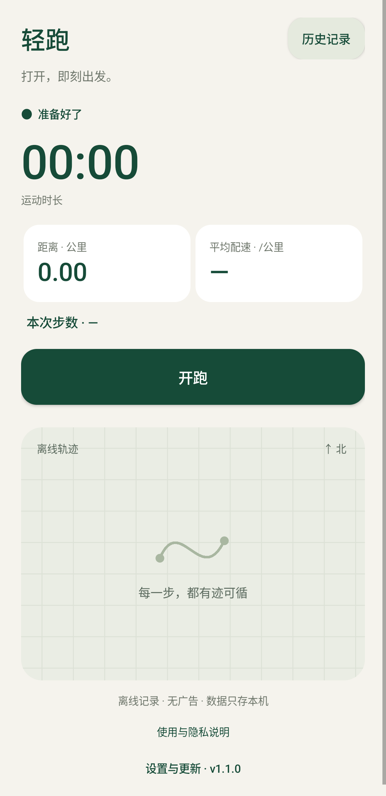
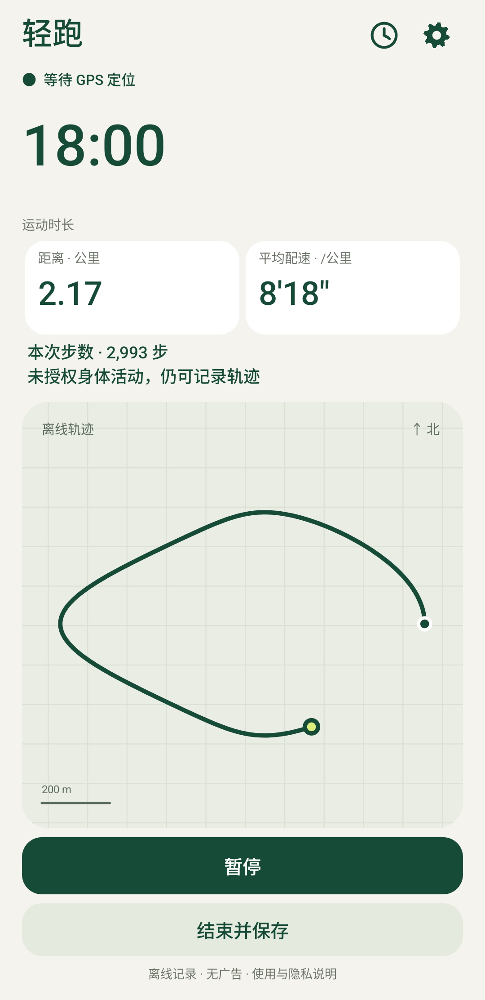
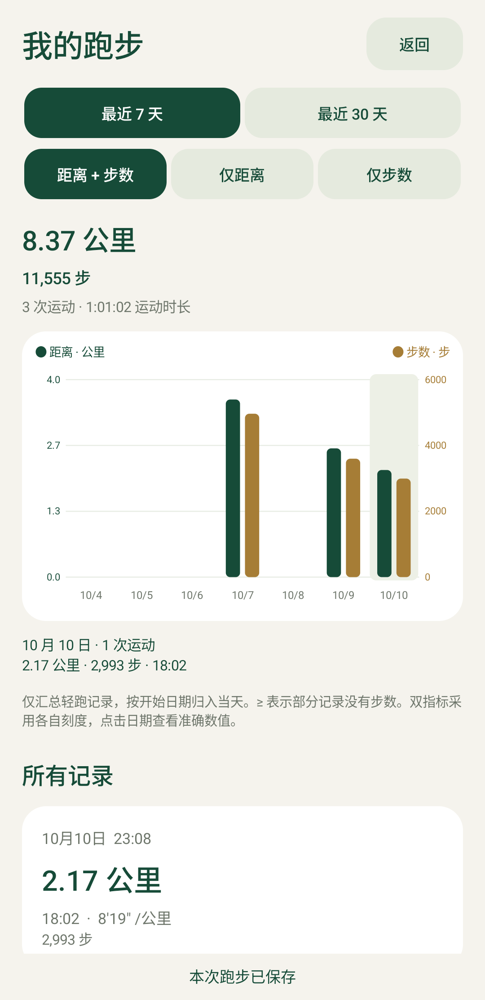
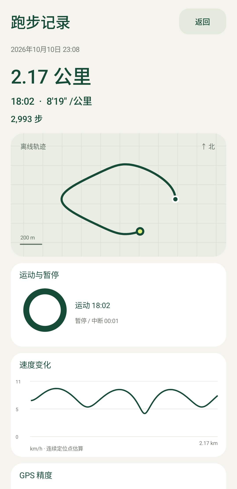
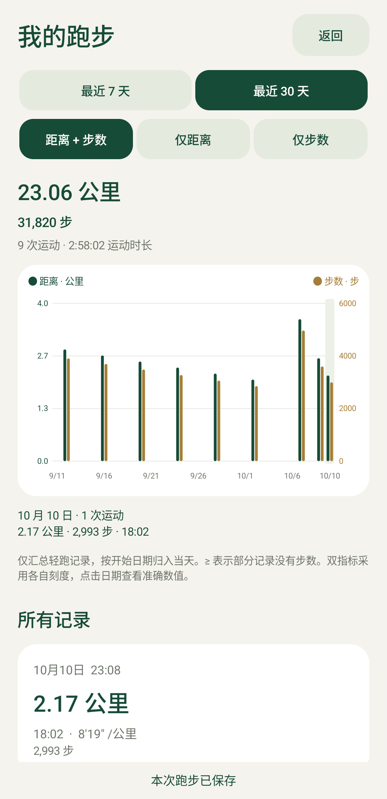
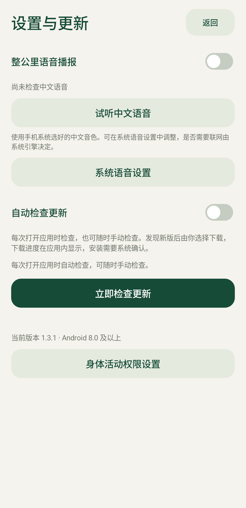

# 轻跑 · LightRun

一个打开就能开跑的极简 Android 跑步轨迹记录器。

无需账号、没有广告、不依赖 Google 服务。跑步记录离线完成，运动数据保存在手机本地；检查更新和主动下载会联网，系统中文语音是否联网由手机引擎决定。

公开源码：[Gitee（国内优先）](https://gitee.com/XLxiaoliao/lightrun) · [GitHub](https://github.com/XLxiaoliaoGmail/lightrun)。

## 界面预览

以下截图来自 v1.3.1 发布版在 Android 模拟器中的实际界面，仅展示应用内容区域。运动记录、步数和轨迹均为演示数据，不包含用户的真实位置或运动历史。模拟器没有计步传感器，因此跑步界面也展示了不支持计步时的提示。

| 首页 · 一键开跑 | 跑步中 · 实时轨迹 |
| :---: | :---: |
|  |  |
| **历史记录** | **轨迹详情 · GPX 导出** |
|  |  |

**30 天完整同屏 · 每天双柱**



**语音与更新设置**



## 功能

- 开跑、暂停、继续、结束保存
- GPS 轨迹、运动时长、距离和平均配速
- 本次跑步步数，暂停期间不累计；没有计步传感器或未授权时仍可记录轨迹
- 整公里中文语音播报，沿用系统中文音色，由前台服务播放；失败有限重试，设置中可查看最近结果
- 每次打开应用自动检查更新，没有每日次数限制，可关闭或手动检查
- 应用内下载更新，显示真实进度，可取消或重试；校验安装包后由系统确认安装
- 首页固定一屏，圆形按钮一键开跑后，所有运动组件从屏幕下方依次上升入场，时钟进入历史、齿轮进入设置
- 锁屏后通过定位前台服务继续记录
- 最近 7 / 30 天按日统计距离、步数，双指标时每天两根柱子、各自刻度；30 天完整同屏，可点选日期或切换单一指标；图表下方列出每次运动
- 完整页面的记录详情，包含离线轨迹、速度和 GPS 精度曲线、运动与暂停环形图
- 平均步频、步长、运动时长等根据实际记录计算，缺失数据标注未记录
- 应用自有确认、帮助、更新和记录详情均使用完整页面；统一渐隐、位移与缩放动效，尊重系统关闭动画的设置
- 结束保存后直接进入本次跑步的详情页面
- 北向上的离线轨迹图、历史记录和删除
- 导出 GPX 1.1 文件
- 当前记录定期保存，异常退出后恢复为暂停状态

轨迹图没有街道底图。距离是 GPS 估算值；室内或弱信号可能少记。暂停和较长的定位中断会分段，避免把缺失路段计入距离。

## 安装

最低 Android 8.0（API 26）。下载 `lightrun-1.3.1.apk`：[Gitee 发布页](https://gitee.com/XLxiaoliao/lightrun/releases/tag/v1.3.1) · [GitHub 发布页](https://github.com/XLxiaoliaoGmail/lightrun/releases/tag/v1.3.1) · [仓库中的发布包](releases/v1.3.1/lightrun-1.3.1.apk)。

从官方 v1.0.0 升级时直接覆盖安装，不要先卸载。旧运动记录会保留，旧记录的步数显示为“未记录”。

开启手机定位，授予精确位置权限后点“开跑”。建议允许通知，并在手机的电池设置中允许应用后台活动。首次使用请在室外锁屏试跑，确认记录持续进行。

计步需要身体活动权限和系统计步传感器；优先使用逐步事件，没有逐步传感器时使用累计计步器。传感器延迟、暂停和中断可能少记步数，数据不是医疗级测量。播报使用手机系统选好的中文音色，不再要求引擎必须提供完整的离线音色列表。可以在系统语音设置中调整音色；是否联网由系统引擎决定，需离线使用时可关闭网络后试听确认。系统引擎可能联网处理播报文字（公里、用时、平均配速），不包含 GPS 轨迹。

## 构建

需要 JDK 17、Android SDK Platform 35 和 Build Tools 35.0.0。Gradle 8.11.1 由仓库内 Wrapper 下载，Android Gradle Plugin 版本为 8.9.2。

设置 `JAVA_HOME`，并通过 `ANDROID_HOME` 或未提交的 `local.properties` 指定 Android SDK。缓存目录可用 `GRADLE_USER_HOME` 自行指定。

```sh
./gradlew assembleDebug
./gradlew assembleRelease lintRelease
```

Windows 可以使用 `gradlew.bat` 或 `./build.ps1`。构建结果位于 `app/build/outputs/apk/`。

默认的 release 构建不带签名。要生成可安装的发布包，将 `signing.properties.example` 复制为 `signing.properties` 并填写自己的密钥信息。官方发布包的私钥不会公开；自行签名的 APK 无法覆盖安装官方签名的 APK。

## 验证

```powershell
./tests/core.ps1
./gradlew.bat assembleDebug assembleDebugAndroidTest lintRelease
```

`RunInstrumentation` 使用合成 GPS 点验证 Android 定位、服务、通知、锁屏、暂停、恢复、保存、删除和 GPX。设备测试需要测试模拟器、定位权限以及 mock-location AppOp。

`tests/release-smoke.ps1` 和 `tests/export-file.ps1` 使用 `adb` 验证发布包界面与系统文件导出。只在测试模拟器上运行：测试会清除轻跑数据，并修改模拟器定位设置。

已完成的版本验证见 [验证记录](docs/VALIDATION.md)。测试语音引擎仅在测试 APK 中，生成测试音而非真实中文发音，不进入正式发布包。

## 数据与隐私

应用不上传位置、步数或运动历史，不发送设备标识。客户端只从 Gitee 获取公开更新元数据和用户主动选择下载的 APK，不请求 GitHub；托管服务会收到普通连接信息（包括 IP 地址）。界面不展示托管平台。关闭自动检查后不安排自动联网任务，手动检查仍会联网。

APK 下载到应用私有缓存，完成后验证 SHA-256、包名、版本、最低系统要求和签名。应用申请安装 APK 的授权，必要时引导到系统设置，最终安装由用户确认；不自动下载或静默安装。取消会清理临时文件，可失败重试；进程结束后需重新下载，不支持断点续传。

检查更新不需要账号令牌。定时任务由 Android 调度，可能受网络或省电策略影响而延后；每次新打开应用或从后台返回也会检查。跑步期间不发起新的更新检查。维护发布方式见 [更新说明](docs/UPDATES.md)，其他项目复用可参考 [Android 更新实现指南](docs/ANDROID-APP-UPDATES.md)。

记录正常情况下每约 5 秒保存一次，异常退出可能丢失最近一个保存周期的数据。卸载会删除记录；重要轨迹请先导出。

公开源码和产物的隐私审查范围见 [发布审查说明](docs/RELEASE-AUDIT.md)。

## 许可证

项目代码采用 [MIT](LICENSE) 许可证。Gradle Wrapper 保留其 Apache-2.0 许可，详见 [第三方许可说明](docs/THIRD-PARTY-NOTICES.md)。
